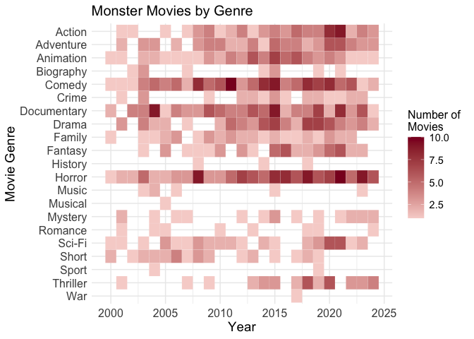

Week 10 Tidy Tuesday Assignment
================
Micaela Chapuis
2024-10-31

- [Assignment Details](#assignment-details)
- [Load Libraries](#load-libraries)
- [Load Data](#load-data)
- [Data Cleaning](#data-cleaning)
- [Plot!](#plot)

## Assignment Details

<https://github.com/rfordatascience/tidytuesday>

For full credit you must:  
- Add a dedicated Tidy_Tuesday folder to your repo for your scripts and
output.  
- You must have proper script structure and file structure.  
- You must submit in a knitted rmarkdown file. You can use any type of
knit output (html, github doc, pdf, whatever you want)  
- You must save your visual in the output folder.  
- You must force yourself to learn at least one NEW thing each week.
This could be anywhere from how you tidy the data to a new geom in
ggplot, new table, new way to edit the theme, new package, etc. You can
also learn something new within rmarkdown. Use this as an opportunity to
really grow your coding skills. State in your markdown file what the new
thing is that you learned.  
- You DO NOT have to use the entirety of the weekly tidy tuesday
dataset. In fact I encourage to subset it in some interesting way
because the files can be huge

## Load Libraries

``` r
library(here)
library(tidyverse)
```

## Load Data

``` r
data <- tidytuesdayR::tt_load('2024-10-29')

monster_movie_genres <- data$monster_movie_genres
monster_movies <- data$monster_movies
```

## Data Cleaning

``` r
movie_data <- left_join(monster_movie_genres, monster_movies, by = "tconst") %>% # join datasets
              select(genres.x, year) %>%  # select only columns I need
              filter(!is.na(genres.x)) %>% # filter out movie genre NAs
              group_by(year) %>% # group by year
              count(genres.x) # count how many times each genre shows up each year
```

## Plot!

**This is my new thing.** I’ve never made a heatmap before, let’s figure
it out!  
I’m focusing on movies released after 2000 so we can see the data better
when we plot it.

``` r
movie_data %>% subset(year >= 2000) %>% # only data after 2000
               ggplot(aes(x = year, 
                          y = fct_rev(factor(genres.x)), # making genres factors and reversing their order so they go in descending alphabetical order (A at the top of the plot)
                          fill =n)) + 
                  geom_tile(color = "white", # adding the slightest white line to differentiate tiles better
                            lwd = 0.03) +
  
                  scale_fill_gradient(low = "#f7d4d0", high = "#8a0025") + # setting color gradient manually
  
                  labs(x = "Year",  # set labels and title
                       y = "Movie Genre", 
                       fill = "Number of \nMovies", # make it two lines so it doesn't make the graph wider
                       title = "Monster Movies by Genre") +
  
                  theme_minimal() + # theme

                  theme(axis.title = element_text(size = 14), # set all the text sizes
                        axis.text = element_text(size = 12),
                        plot.title = element_text(size = 15),
                        legend.title = element_text(size = 12),
                        legend.text = element_text(size = 11))
```

<!-- -->

``` r
ggsave(here("Tidy_Tuesday", "Week10", "Output", "w10_tidytuesday.jpeg"))
```
