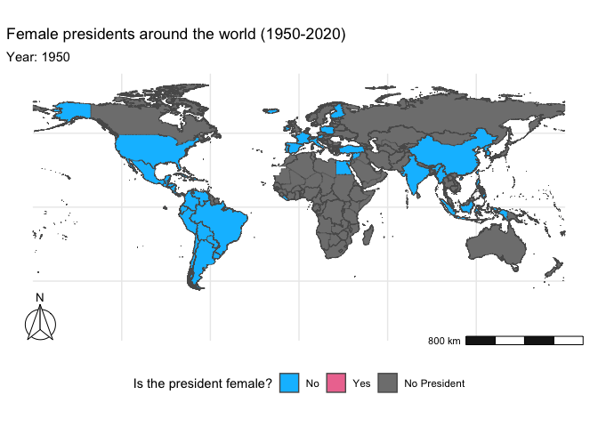

Week 11 Tidy Tuesday Assignment
================
Micaela Chapuis
2024-11-01

- [What is new?](#what-is-new)
- [Load Libraries](#load-libraries)
- [Load Data](#load-data)
- [Cleaning Data](#cleaning-data)
- [Making our map](#making-our-map)

## What is new?

This week I’m using the ‘sf’ package (new to me) and importing a
shapefile to make a map (also new)!  
I’m following this (also this is the shapefile source):  
<https://dds.rodrigozamith.com/cartography-and-journalism/creating-static-maps-with-r/>  
<https://dds.rodrigozamith.com/cartography-and-journalism/creating-animated-maps-with-r/>

## Load Libraries

``` r
library(here)
library(tidyverse)
library(sf) # new package to make maps
library(ggspatial) # to add scale bars and compass arrows
library(gganimate) # to animate the points on the map
library(gifski)    # to render the animated map into a gif
```

## Load Data

Reading in Tidy Tuesday Data

``` r
data <- readr::read_csv('https://raw.githubusercontent.com/rfordatascience/tidytuesday/master/data/2024/2024-11-05/democracy_data.csv') 
```

Reading in Shapefile from my Data folder

``` r
world_map <- st_read(here("Tidy_Tuesday", "Week11", "Data", "TM_WORLD_BORDERS-0.3", "TM_WORLD_BORDERS-0.3.shp"))
```

    ## Reading layer `TM_WORLD_BORDERS-0.3' from data source 
    ##   `/Users/micachapuis/GitHub/OCN 682/Chapuis/Tidy_Tuesday/Week11/Data/TM_WORLD_BORDERS-0.3/TM_WORLD_BORDERS-0.3.shp' 
    ##   using driver `ESRI Shapefile'
    ## Simple feature collection with 246 features and 11 fields
    ## Geometry type: MULTIPOLYGON
    ## Dimension:     XY
    ## Bounding box:  xmin: -180 ymin: -90 xmax: 180 ymax: 83.6236
    ## Geodetic CRS:  WGS 84

## Cleaning Data

Keeping only the columns we need

``` r
data <- data %>% 
        select(country_name, country_code, year, is_female_president) %>% # selecting columns
        mutate(country_code = recode(country_code, "ZAR" = "COD")) # renaming to match world_map code
```

Joining our data with world map dataset (by country code because idk if
the country names match)

``` r
mapdata <- left_join(world_map, data, by=c("iso3"="country_code")) # joining datasets by country code
```

## Making our map

``` r
map <- mapdata %>% ggplot(aes(fill = is_female_president)) + # fill country by whether president is female or not
                   geom_sf() + # add country shapes
  
                   theme_minimal() +
                   scale_fill_manual(values = c("deepskyblue", "palevioletred2"), labels = c("No", "Yes", "No President")) + # set colors and legend labels 
  
                   transition_manual(year) + # animate by year
  
                   labs(title = "Female presidents around the world (1950-2020)", # set titles
                        subtitle = "Year: {current_frame}",
                        fill = "Is the president female?") +
  
                   theme(legend.position = "bottom") + # put legend along the bottom
  
                   annotation_scale(bar_cols = c("grey10", "white"), # add scale bar, make colors dark grey and white
                                    location = "br") +  # put it in the bottom right
  
                   annotation_north_arrow(location = "bl",# add a north arrow in bottom left
                                          height = unit(1.5, "cm"), # set size
                                          width = unit(1.5, "cm"),
                                          style = north_arrow_fancy_orienteering(text_col = 'black', # set type of arrow and   colors for all its parts
                                                                                 line_col = 'black',
                                                                                 fill = 'white')) +
                   coord_sf(crs = 4326) # necessary crs for scale bar to work

animate(map, nframes = 500)
```

<!-- -->

``` r
anim_save(here("Tidy_Tuesday", "Week11", "Output", "w11_tidytuesday.gif"))
```
