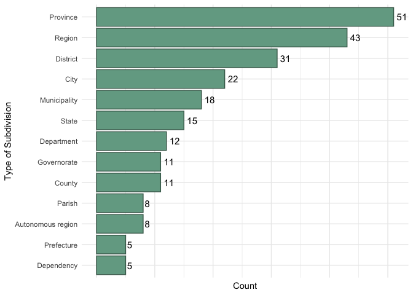

Week 12 Tidy Tuesday Assignment
================
Micaela Chapuis
2024-11-07

- [Load Libraries](#load-libraries)
- [Load Data](#load-data)
- [Summarize data](#summarize-data)
- [What are the most common types of
  subdivisions?](#what-are-the-most-common-types-of-subdivisions)

## Load Libraries

``` r
library(here)
library(tidyverse)
```

## Load Data

``` r
countries <- readr::read_csv('https://raw.githubusercontent.com/rfordatascience/tidytuesday/master/data/2024/2024-11-12/countries.csv')
country_subdivisions <- readr::read_csv('https://raw.githubusercontent.com/rfordatascience/tidytuesday/master/data/2024/2024-11-12/country_subdivisions.csv')
former_countries <- readr::read_csv('https://raw.githubusercontent.com/rfordatascience/tidytuesday/master/data/2024/2024-11-12/former_countries.csv')
```

## Summarize data

``` r
data <- country_subdivisions %>%
  select(alpha_2, type) %>% # keeping only the columns I care about
  group_by(alpha_2, type) %>% 
  slice(1) %>%  # select the first row within each group combination so we have a list of what types of subdivision each country has
  group_by(type) %>% # now group only by type cause we don't care which country they are in
  summarize(type_count = length(type)) %>% # count how many times each type of subdivision appears
  filter(type_count >= 5 )  # only keep subdivisions that appear at 5 times or more to keep graph nice looking

data
```

    ## # A tibble: 13 × 2
    ##    type              type_count
    ##    <chr>                  <int>
    ##  1 Autonomous region          8
    ##  2 City                      22
    ##  3 County                    11
    ##  4 Department                12
    ##  5 Dependency                 5
    ##  6 District                  31
    ##  7 Governorate               11
    ##  8 Municipality              18
    ##  9 Parish                     8
    ## 10 Prefecture                 5
    ## 11 Province                  51
    ## 12 Region                    43
    ## 13 State                     15

## What are the most common types of subdivisions?

My new thing this week is adding the labels with numbers by the bars

``` r
ggplot(data, aes(x= reorder(type, type_count), y= type_count)) + # order the types by count value
  geom_bar(color = "#456758", fill = "#74a892", stat='identity') + 
  geom_text(aes(label = type_count), hjust = -0.3, size = 4) + # add label of the count number, slightly to the right of the columns
  coord_flip() + # switch x and y
  theme_minimal() + 
  labs(y = "Count", 
       x = "Type of Subdivision") +
  theme(axis.text.x = element_blank()) # removing x axis labels so it's not redundant since I have the labels by the bars
```

<!-- -->

``` r
ggsave(here("Tidy_Tuesday", "Week12", "Output", "w12_tidytuesday.jpeg"))
```
