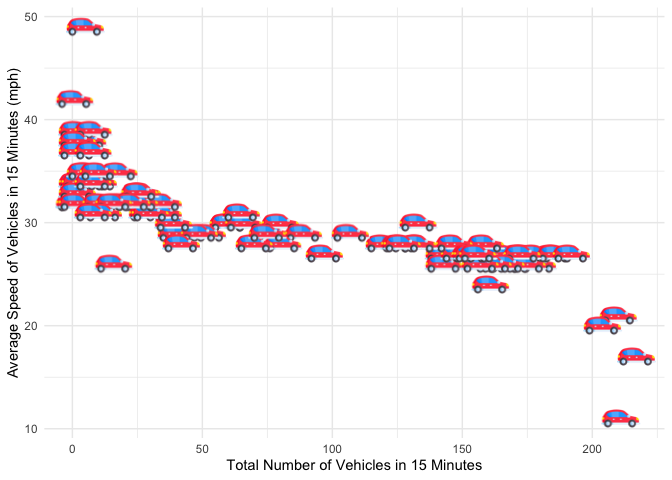

W15 Tidy Tuesday
================
Micaela Chapuis
2024-11-27

## Load Libraries

``` r
library(tidyverse)
library(here)
library(janitor)
library(ggimage)
```

## Load Data + Clean Column Names

``` r
traffic_data <- readr::read_csv('https://raw.githubusercontent.com/rfordatascience/tidytuesday/master/data/2024/2024-12-03/A64_traffic.csv') %>% clean_names()
```

This week I will use the ‘ggimage’ package to import an image of a car
and use as the point in my plot.

First I will find the image in my Data folder and store it as “image”

``` r
image <- here("Tidy_Tuesday", "Week15", "Data", "car-icon.png") # file path to car icon in my Data folder
```

I will filter the data to show only one day at one site so there’s not a
crazy amount of points

``` r
traffic_data <- traffic_data %>%
                filter(site_id == 6867 & report_date == as.Date('2021-05-01')) # filter for specific site and day
```

## Plot - Does average speed change if there’s more or less cars?

``` r
ggplot(traffic_data, aes(total_volume, avg_mph)) +
  geom_image(image=image, size = 0.09) + # using image as my geom/point, specify size
  labs(x = "Total Number of Vehicles in 15 Minutes", # axis labels
       y = "Average Speed of Vehicles in 15 Minutes (mph)") +
  theme_minimal() # simple theme
```

<!-- -->

``` r
ggsave(here("Tidy_Tuesday", "Week15", "Output", "w15_tidytuesday.jpeg"))
```
