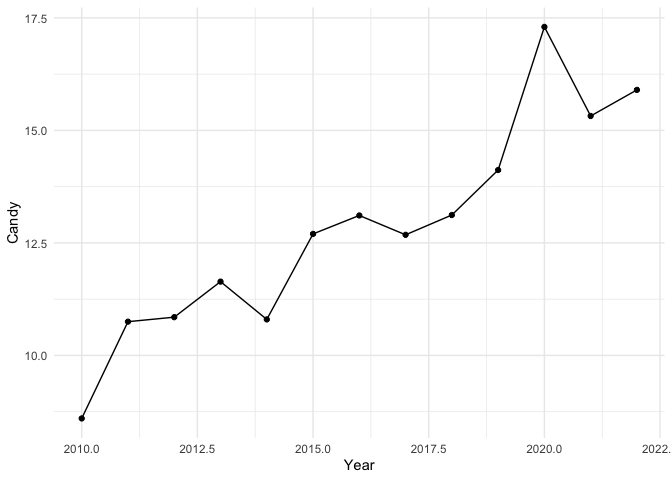
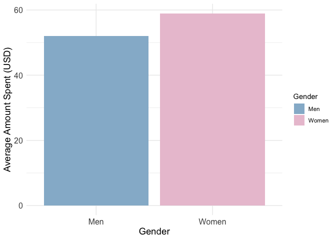

W12 Shiny Code Testing - Homework
================
Micaela Chapuis
2024-11-13

In this document I will write the code that I will then use in my Shiny
App, so I can explore the data and make sure my code works before
running the app.

**NOTE: Code is not commented, or cleaned. This is just for testing**

You can find the final app at:
<https://mchapuis.shinyapps.io/W12-ShinyHomework/>

## Assignment Details

Make a shiny app: Use any data set to make a shiny app. Your app must
have at least one dynamic figure and one other output (can be anything).
You must publish it on shinyapps.io so that we can view your app
online.  
- 3 points dynamic figure  
- 3 points additional output  
- 2 points published (**add the link to your shiny app to your readme
file so we can easily find it**)  
- 1 point - creativity  
- 1 point - clean and clear repository

## Load Libraries

``` r
library(tidyverse)
```

## Load Data

``` r
data <- readr::read_csv('https://raw.githubusercontent.com/rfordatascience/tidytuesday/master/data/2024/2024-02-13/historical_spending.csv')
```

``` r
data %>% select(Year, Candy, Flowers, Jewelry, GreetingCards, EveningOut, Clothing, GiftCards) %>%
    pivot_longer(!Year, names_to = "Item", values_to = "Value") %>%
    filter(Item == "Candy")
```

    ## # A tibble: 13 × 3
    ##     Year Item  Value
    ##    <dbl> <chr> <dbl>
    ##  1  2010 Candy   8.6
    ##  2  2011 Candy  10.8
    ##  3  2012 Candy  10.8
    ##  4  2013 Candy  11.6
    ##  5  2014 Candy  10.8
    ##  6  2015 Candy  12.7
    ##  7  2016 Candy  13.1
    ##  8  2017 Candy  12.7
    ##  9  2018 Candy  13.1
    ## 10  2019 Candy  14.1
    ## 11  2020 Candy  17.3
    ## 12  2021 Candy  15.3
    ## 13  2022 Candy  15.9

Plan:

dynamic plot: line plot with year on the x axis, average amount spent
per year on the y axis. dropdown where you choose which variable to plot
(clothing, giftcards, candy, flowers, etc)

``` r
data %>% ggplot(aes(x = Year, y = Candy)) +
  geom_line() +
  geom_point() +
  theme_minimal()
```

<!-- -->

## Additional item

``` r
gifts_gender <- readr::read_csv('https://raw.githubusercontent.com/rfordatascience/tidytuesday/master/data/2024/2024-02-13/gifts_gender.csv') %>%
                          select(!SpendingCelebrating) %>%
                          pivot_longer(!Gender, names_to = "Item", values_to = "Value") %>%
                          filter(Item %in% "Candy")
```

``` r
    ggplot(gifts_gender, aes(x = Gender, y = Value, fill = Gender)) + 
      geom_bar(stat = "identity") + 
      theme_minimal() + 
      labs(y = "Average Amount Spent (USD)") +
      theme(axis.text = element_text(size = 12),
            axis.title = element_text(size = 14)) +
      scale_fill_manual(values = c("#95b8d1", "#eac4d5"))
```

<!-- -->
