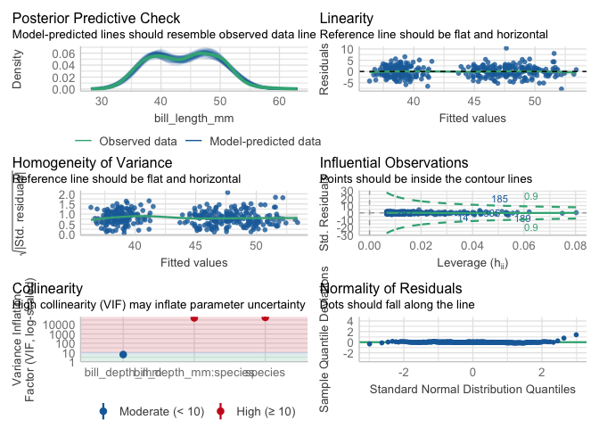
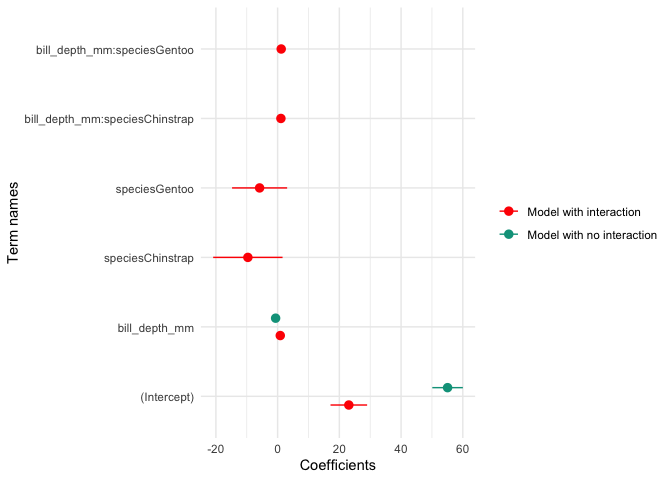
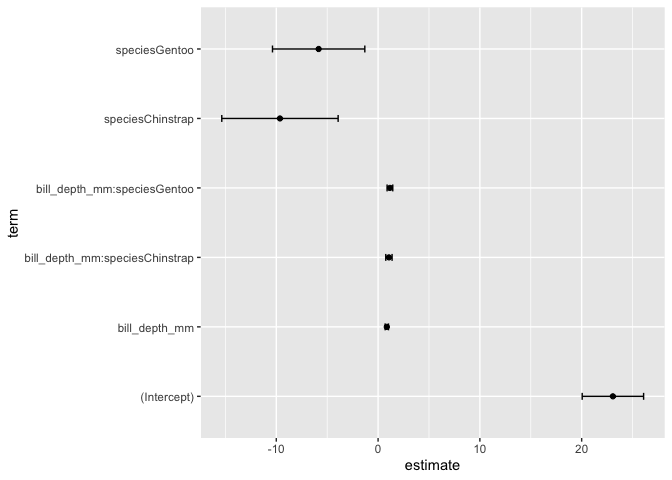

W15 Lecture B
================
Micaela Chapuis
2024-12-07

# Lecture 15B - Intro to Models

## Load Libraries

``` r
library(tidyverse)
library(here)
library(palmerpenguins)
library(broom)
library(performance) 
library(modelsummary)
library(tidymodels)
```

## Anatomy of a basic linear model

To run a simple linear model you use the following formula:

mod\<-lm(y~x, data = df)

lm = linear model, y = dependent variable, x = independent variable(s),
df = dataframe.

You read this as y is a function of x

**Multiple regression**  
mod\<-lm(y~x1 + x2, data = df)

**Interaction term**  
mod\<-lm(y~x1*x2, data = df) the * will compute x1+x2+x1:x2

## Penguin Data

Hyp: Bill depth of a penguin is the main driver of the bill length, and
that relationship changes by species

``` r
# Linear model of Bill depth ~ Bill length by species
Peng_mod<-lm(bill_length_mm ~ bill_depth_mm*species, data = penguins)
```

### Model Assumptions

Checking model assumptions with {performance}. Should do this before
looking at model results.

``` r
check_model(Peng_mod) # check assumptions of an lm model
```

<!-- -->

### Viewing Results in base R

ANOVA Table

``` r
anova(Peng_mod)
```

    ## Analysis of Variance Table
    ## 
    ## Response: bill_length_mm
    ##                        Df Sum Sq Mean Sq F value    Pr(>F)    
    ## bill_depth_mm           1  561.6   561.6  93.965 < 2.2e-16 ***
    ## species                 2 7460.3  3730.2 624.151 < 2.2e-16 ***
    ## bill_depth_mm:species   2  134.3    67.1  11.232 1.898e-05 ***
    ## Residuals             336 2008.1     6.0                      
    ## ---
    ## Signif. codes:  0 '***' 0.001 '**' 0.01 '*' 0.05 '.' 0.1 ' ' 1

``` r
# significant relationship between bill depth and length
# significant difference in bill length across the three species 
# the relationship between bill depth and bill length does change by species
```

Coefficients (effect size) with error

``` r
summary(Peng_mod)
```

    ## 
    ## Call:
    ## lm(formula = bill_length_mm ~ bill_depth_mm * species, data = penguins)
    ## 
    ## Residuals:
    ##     Min      1Q  Median      3Q     Max 
    ## -7.7888 -1.5415  0.0575  1.5873 10.3590 
    ## 
    ## Coefficients:
    ##                                Estimate Std. Error t value Pr(>|t|)    
    ## (Intercept)                     23.0681     3.0165   7.647 2.18e-13 ***
    ## bill_depth_mm                    0.8570     0.1641   5.224 3.08e-07 ***
    ## speciesChinstrap                -9.6402     5.7154  -1.687 0.092590 .  
    ## speciesGentoo                   -5.8386     4.5353  -1.287 0.198850    
    ## bill_depth_mm:speciesChinstrap   1.0651     0.3100   3.435 0.000666 ***
    ## bill_depth_mm:speciesGentoo      1.1637     0.2789   4.172 3.84e-05 ***
    ## ---
    ## Signif. codes:  0 '***' 0.001 '**' 0.01 '*' 0.05 '.' 0.1 ' ' 1
    ## 
    ## Residual standard error: 2.445 on 336 degrees of freedom
    ##   (2 observations deleted due to missingness)
    ## Multiple R-squared:  0.8024, Adjusted R-squared:  0.7995 
    ## F-statistic: 272.9 on 5 and 336 DF,  p-value: < 2.2e-16

``` r
# only shows two species because the lowest letter in alphabetical order is absorbed within intercept
```

### Viewing results with broom

Cleaning up our results

``` r
# Tidy Coefficients
coeffs <- tidy(Peng_mod)
coeffs
```

    ## # A tibble: 6 × 5
    ##   term                           estimate std.error statistic  p.value
    ##   <chr>                             <dbl>     <dbl>     <dbl>    <dbl>
    ## 1 (Intercept)                      23.1       3.02       7.65 2.18e-13
    ## 2 bill_depth_mm                     0.857     0.164      5.22 3.08e- 7
    ## 3 speciesChinstrap                 -9.64      5.72      -1.69 9.26e- 2
    ## 4 speciesGentoo                    -5.84      4.54      -1.29 1.99e- 1
    ## 5 bill_depth_mm:speciesChinstrap    1.07      0.310      3.44 6.66e- 4
    ## 6 bill_depth_mm:speciesGentoo       1.16      0.279      4.17 3.84e- 5

**glance** extracts R-squared, AICs, etc of model

``` r
results <- glance(Peng_mod)
results
```

    ## # A tibble: 1 × 12
    ##   r.squared adj.r.squared sigma statistic   p.value    df logLik   AIC   BIC
    ##       <dbl>         <dbl> <dbl>     <dbl>     <dbl> <dbl>  <dbl> <dbl> <dbl>
    ## 1     0.802         0.799  2.44      273. 5.69e-116     5  -788. 1590. 1617.
    ## # ℹ 3 more variables: deviance <dbl>, df.residual <int>, nobs <int>

**augment** add residuals and predicted values to your original data,
and requires that you put both the model and data

``` r
resid_fitted <- augment(Peng_mod)
resid_fitted
```

    ## # A tibble: 342 × 10
    ##    .rownames bill_length_mm bill_depth_mm species .fitted   .resid    .hat
    ##    <chr>              <dbl>         <dbl> <fct>     <dbl>    <dbl>   <dbl>
    ##  1 1                   39.1          18.7 Adelie     39.1  0.00553 0.00719
    ##  2 2                   39.5          17.4 Adelie     38.0  1.52    0.0107 
    ##  3 3                   40.3          18   Adelie     38.5  1.81    0.00716
    ##  4 5                   36.7          19.3 Adelie     39.6 -2.91    0.0107 
    ##  5 6                   39.3          20.6 Adelie     40.7 -1.42    0.0295 
    ##  6 7                   38.9          17.8 Adelie     38.3  0.577   0.00797
    ##  7 8                   39.2          19.6 Adelie     39.9 -0.666   0.0137 
    ##  8 9                   34.1          18.1 Adelie     38.6 -4.48    0.00690
    ##  9 10                  42            20.2 Adelie     40.4  1.62    0.0221 
    ## 10 11                  37.8          17.1 Adelie     37.7  0.0768  0.0136 
    ## # ℹ 332 more rows
    ## # ℹ 3 more variables: .sigma <dbl>, .cooksd <dbl>, .std.resid <dbl>

### Viewing results in {modelsummary}

modelsummary includes two families of functions:

Model Summary  
- modelsummary: Regression tables with side-by-side models.  
- modelsummary_wide: Regression tables for categorical response models
or grouped coefficients.  
- modelplot: Coefficient plots.

Data Summary  
- datasummary: Powerful tool to create (multi-level) cross-tabs and data
summaries.  
- datasummary_balance: Balance tables with subgroup statistics and
difference in means (aka “Table 1”).  
- datasummary_correlation: Correlation tables.  
- datasummary_skim: Quick overview (“skim”) of a dataset.  
- datasummary_df: Turn dataframes into nice tables with titles, notes,
etc.

Let’s compare the Peng_mod with one that does not have species as an
interaction term.

``` r
# New model
Peng_mod_noX<-lm(bill_length_mm ~ bill_depth_mm, data = penguins)
```

``` r
#Make a list of models and name them
models<-list("Model with interaction" = Peng_mod,
             "Model with no interaction" = Peng_mod_noX)
#Save the results as a .docx
modelsummary(models, output = here("Week15","Output", "Lecture", "table.docx"))
```

Coefficient plot to compare the models to each other

``` r
library(wesanderson)

modelplot(models) +
    labs(x = 'Coefficients', 
         y = 'Term names') +
    scale_color_manual(values = wes_palette('Darjeeling1'))
```

<!-- -->

## Many models with purrr, dplyr, and broom

Let’s say you want to plot and compare lots of different models at the
same time and view the results. For example, instead of using species as
an interaction term, let’s make an individual model for every species.

We can essentially make a set of lists that have each dataset that we
want to model and use the map functions to run the same model to every
dataset. We will test it step by step

### Nest data

First, let’s call the penguin data and create a list for the data by
each species. We do this using nest(). We are going to nest the data by
species.  
(In this dataset, they’re already grouped by species so we will ungroup
them first. Then group by species because we want to run an individual
model for each species)

``` r
models<- penguins %>%
  ungroup()%>% # the penguin data are grouped so we need to ungroup them
    nest(.by = species) # nest all the data by species

models 
```

    ## # A tibble: 3 × 2
    ##   species   data              
    ##   <fct>     <list>            
    ## 1 Adelie    <tibble [152 × 6]>
    ## 2 Gentoo    <tibble [124 × 6]>
    ## 3 Chinstrap <tibble [68 × 6]>

``` r
# creates a tibble that contains a tibble with the data for each species 
```

### Map model

Map a model to each of the groups in the list

``` r
models<- penguins %>%
  ungroup()%>% # the penguin data are grouped so we need to ungroup them
  nest(.by = species) %>% # nest all the data by species 
  mutate(fit = map(data, ~lm(bill_length_mm~body_mass_g, data = .))) # iterates for every line of the tibble, using the function we created which is run a linear model with bill length and body mass, using the data we give it


  models
```

    ## # A tibble: 3 × 3
    ##   species   data               fit   
    ##   <fct>     <list>             <list>
    ## 1 Adelie    <tibble [152 × 6]> <lm>  
    ## 2 Gentoo    <tibble [124 × 6]> <lm>  
    ## 3 Chinstrap <tibble [68 × 6]>  <lm>

``` r
models$fit # shows you each of the 3 models
```

    ## [[1]]
    ## 
    ## Call:
    ## lm(formula = bill_length_mm ~ body_mass_g, data = .)
    ## 
    ## Coefficients:
    ## (Intercept)  body_mass_g  
    ##   26.994139     0.003188  
    ## 
    ## 
    ## [[2]]
    ## 
    ## Call:
    ## lm(formula = bill_length_mm ~ body_mass_g, data = .)
    ## 
    ## Coefficients:
    ## (Intercept)  body_mass_g  
    ##   26.739548     0.004091  
    ## 
    ## 
    ## [[3]]
    ## 
    ## Call:
    ## lm(formula = bill_length_mm ~ body_mass_g, data = .)
    ## 
    ## Coefficients:
    ## (Intercept)  body_mass_g  
    ##   32.174193     0.004463

### View results

View the results. First, let’s mutate the models list so that we have a
tidy coefficient dataframe (using tidy()) and a tidy model results
dataframe (using glance())

``` r
results <- models %>%
           mutate(coeffs = map(fit, tidy), # look at the coefficients: new column using map because it takes each dataset separately. Use the function tidy on all the fit data
                 modelresults = map(fit, glance))  # R2 and others: new column using the function glance on all the fit data
results
```

    ## # A tibble: 3 × 5
    ##   species   data               fit    coeffs           modelresults     
    ##   <fct>     <list>             <list> <list>           <list>           
    ## 1 Adelie    <tibble [152 × 6]> <lm>   <tibble [2 × 5]> <tibble [1 × 12]>
    ## 2 Gentoo    <tibble [124 × 6]> <lm>   <tibble [2 × 5]> <tibble [1 × 12]>
    ## 3 Chinstrap <tibble [68 × 6]>  <lm>   <tibble [2 × 5]> <tibble [1 × 12]>

Next, select what we want to show and unnest it to bring it back to a
dataframe

``` r
 results<-models %>%
   mutate(coeffs = map(fit, tidy), # look at the coefficients
          modelresults = map(fit, glance)) %>% # R2 and others 
   select(species, coeffs, modelresults) %>% # only keep the results
   unnest() # put it back in a dataframe and specify which columns to unnest
```

``` r
view(results) # view the results
```

## {Tidymodels}

In tidymodels you start by specifying the functional form using the
parsnip package. In our case, we will use a linear regression which is
coded like this:

``` r
linear_reg()
```

    ## Linear Regression Model Specification (regression)
    ## 
    ## Computational engine: lm

Next, we need to set the engine for what type of linear regression we
are modeling. For example, we could use an OLS regression or Bayesian or
several other options. We will stick with OLS (the basic, what most
people do).

``` r
lm_mod<-linear_reg() %>%
  set_engine("lm")

lm_mod
```

    ## Linear Regression Model Specification (regression)
    ## 
    ## Computational engine: lm

Next, we add the model fit

``` r
lm_mod<-linear_reg() %>%
  set_engine("lm") %>%
  fit(bill_length_mm ~ bill_depth_mm*species, data = penguins)

lm_mod
```

    ## parsnip model object
    ## 
    ## 
    ## Call:
    ## stats::lm(formula = bill_length_mm ~ bill_depth_mm * species, 
    ##     data = data)
    ## 
    ## Coefficients:
    ##                    (Intercept)                   bill_depth_mm  
    ##                         23.068                           0.857  
    ##               speciesChinstrap                   speciesGentoo  
    ##                         -9.640                          -5.839  
    ## bill_depth_mm:speciesChinstrap     bill_depth_mm:speciesGentoo  
    ##                          1.065                           1.164

Lastly, we add the tidy it. And now we can pipe this into plots, etc.
Nice, tidy way to model.

``` r
lm_mod<-linear_reg() %>%
  set_engine("lm") %>%
  fit(bill_length_mm ~ bill_depth_mm*species, data = penguins) %>%
  tidy()

lm_mod
```

    ## # A tibble: 6 × 5
    ##   term                           estimate std.error statistic  p.value
    ##   <chr>                             <dbl>     <dbl>     <dbl>    <dbl>
    ## 1 (Intercept)                      23.1       3.02       7.65 2.18e-13
    ## 2 bill_depth_mm                     0.857     0.164      5.22 3.08e- 7
    ## 3 speciesChinstrap                 -9.64      5.72      -1.69 9.26e- 2
    ## 4 speciesGentoo                    -5.84      4.54      -1.29 1.99e- 1
    ## 5 bill_depth_mm:speciesChinstrap    1.07      0.310      3.44 6.66e- 4
    ## 6 bill_depth_mm:speciesGentoo       1.16      0.279      4.17 3.84e- 5

### Pipe directly to a plot

``` r
lm_mod<-linear_reg() %>%
  set_engine("lm") %>%
  fit(bill_length_mm ~ bill_depth_mm*species, data = penguins) %>%
  tidy() %>%
  ggplot()+
    geom_point(aes(x = term, y = estimate))+
    geom_errorbar(aes(x = term, ymin = estimate-std.error,
                      ymax = estimate+std.error), width = 0.1 )+
  coord_flip()

lm_mod
```

<!-- -->
