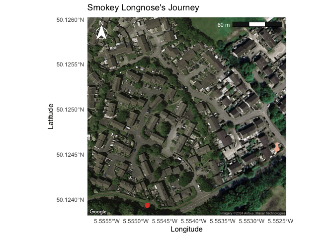

W7 Homework
================
Micaela Chapuis
2024-10-09

- [Assignment Details](#assignment-details)
- [Dataset Details](#dataset-details)
- [Loading Libraries](#loading-libraries)
- [Getting the Data](#getting-the-data)
  - [Looking at Data](#looking-at-data)
- [Data Processing](#data-processing)
  - [Joining datasets, selecting columns I want to keep, and selecting
    specific
    cat](#joining-datasets-selecting-columns-i-want-to-keep-and-selecting-specific-cat)
  - [Getting Smokey’s mean coordinates + Getting base layer centered
    around
    those](#getting-smokeys-mean-coordinates--getting-base-layer-centered-around-those)
- [Making the Map!](#making-the-map)

## Assignment Details

You need to make a map using RMarkdown with one of the following
datasets from past Tidy Tuesdays.  
Make sure, as usual, that you scripts and output are saved
appropriately.

## Dataset Details

Using the Pet Cats UK dataset available
[here.](https://github.com/rfordatascience/tidytuesday/blob/master/data/2023/2023-01-31/readme.md)

**Original article:**  
Kays R, Dunn RR, Parsons AW, Mcdonald B, Perkins T, Powers S, Shell L,
McDonald JL, Cole H, Kikillus H, Woods L, Tindle H, Roetman P (2020) The
small home ranges and large local ecological impacts of pet cats. Animal
Conservation. <doi:10.1111/acv.12563>

**Movebank data package:**  
McDonald JL, Cole H (2020) Data from: The small home ranges and large
local ecological impacts of pet cats \[United Kingdom\]. Movebank Data
Repository. <doi:10.5441/001/1.pf315732>

## Loading Libraries

``` r
library(tidyverse)
library(here)
library(ggmap)
library(ggspatial) # to add scale bars and compass arrows
library(gganimate) # to animate the points on the map
library(gifski)    # to render the animated map into a gif
```

## Getting the Data

``` r
tuesdata <- tidytuesdayR::tt_load('2023-01-31')
tuesdata <- tidytuesdayR::tt_load(2023, week = 5)

cats_uk <- tuesdata$cats_uk
cats_uk_reference <- tuesdata$cats_uk_reference

# Or I could've read in the data manually:

# cats_uk <- readr::read_csv('https://raw.githubusercontent.com/rfordatascience/tidytuesday/master/data/2023/2023-01-31/cats_uk.csv')
# cats_uk_reference <- readr::read_csv('https://raw.githubusercontent.com/rfordatascience/tidytuesday/master/data/2023/2023-01-31/cats_uk_reference.csv')
```

### Looking at Data

``` r
head(cats_uk)
```

    ## # A tibble: 6 × 11
    ##   tag_id   event_id visible timestamp           location_long location_lat
    ##   <chr>       <dbl> <lgl>   <dttm>                      <dbl>        <dbl>
    ## 1 Ares   3395610551 TRUE    2017-06-24 01:03:57         -5.11         50.2
    ## 2 Ares   3395610552 TRUE    2017-06-24 01:11:20         -5.11         50.2
    ## 3 Ares   3395610553 TRUE    2017-06-24 02:58:16         -5.11         50.2
    ## 4 Ares   3395610554 TRUE    2017-06-24 03:01:26         -5.11         50.2
    ## 5 Ares   3395610555 TRUE    2017-06-24 03:51:58         -5.11         50.2
    ## 6 Ares   3395610556 TRUE    2017-06-24 03:55:03         -5.11         50.2
    ## # ℹ 5 more variables: ground_speed <dbl>, height_above_ellipsoid <dbl>,
    ## #   algorithm_marked_outlier <lgl>, manually_marked_outlier <lgl>,
    ## #   study_name <chr>

``` r
head(cats_uk_reference)
```

    ## # A tibble: 6 × 16
    ##   tag_id    animal_id animal_taxon deploy_on_date      deploy_off_date     hunt 
    ##   <chr>     <chr>     <chr>        <dttm>              <dttm>              <lgl>
    ## 1 Tommy-Tag Tommy     Felis catus  2017-06-03 01:02:09 2017-06-10 02:10:52 TRUE 
    ## 2 Athena    Athena    Felis catus  2017-06-24 01:02:13 2017-06-30 23:59:32 TRUE 
    ## 3 Ares      Ares      Felis catus  2017-06-24 01:03:57 2017-06-30 23:58:01 NA   
    ## 4 Lola      Lola      Felis catus  2017-06-24 01:18:49 2017-06-30 09:04:40 TRUE 
    ## 5 Maverick  Maverick  Felis catus  2017-06-25 01:04:35 2017-07-03 09:10:07 TRUE 
    ## 6 Coco      Coco      Felis catus  2017-06-28 01:02:22 2017-07-05 06:50:04 TRUE 
    ## # ℹ 10 more variables: prey_p_month <dbl>, animal_reproductive_condition <chr>,
    ## #   animal_sex <chr>, hrs_indoors <dbl>, n_cats <dbl>, food_dry <lgl>,
    ## #   food_wet <lgl>, food_other <lgl>, study_site <chr>, age_years <dbl>

First, I want to see how many different unique cats are included, so I
use length to get the count of unique tag_ids. Because there are so
many, I want to look at what their names are so I can then choose only
one of them (the one with the coolest name, obviously).

``` r
length(unique(cats_uk$tag_id)) # how many unique tags are there
```

    ## [1] 101

``` r
unique(cats_uk$tag_id) # what are the tag/cats names
```

    ##   [1] "Ares"                "Athena"              "Lola"               
    ##   [4] "Jago"                "Maverick"            "Charlie"            
    ##   [7] "Coco"                "Friday"              "Meg-Tag"            
    ##  [10] "Morpheus-Tag"        "Nettle-Tag"          "Carbonel-Tag"       
    ##  [13] "Tommy-Tag"           "Whiskey-Tag"         "Sparky-Tag"         
    ##  [16] "Indie-Tag"           "Mifty-Tag"           "Rusty-Tag"          
    ##  [19] "Jessy-Tag"           "Barney-Tag"          "Fonzie-Tag"         
    ##  [22] "Johnny-Tag"          "Wilfred-Tag"         "Henry-Tag"          
    ##  [25] "Ladyboyhawke-Tag"    "Pussy-Tag"           "Poppet-Tag"         
    ##  [28] "Winnie-Tag"          "Lady T-Tag"          "Bella-Tag"          
    ##  [31] "Tom-Tag"             "Charlie2-Tag"        "Max-Tag"            
    ##  [34] "Chloe-Tag"           "Bear-Tag"            "Bumbles-Tag"        
    ##  [37] "Ebby-Tag"            "Binky-Tag"           "Beanie-Tag"         
    ##  [40] "Sid-Tag"             "Merlin-Tag"          "Felix-Tag"          
    ##  [43] "Amber-Tag"           "Ernie-Tag"           "Maxwell-Tag"        
    ##  [46] "Bits-Tag"            "Bobs-Tag"            "Lightening Bugg-Tag"
    ##  [49] "Smudge-Tag"          "Tigger-Tag"          "Magic-Tag"          
    ##  [52] "Skye-Tag"            "Dory-Tag"            "Boots-Tag"          
    ##  [55] "Jago2-Tag"           "Jezebel-Tag"         "Spike-Tag"          
    ##  [58] "Frank-Tag"           "Smudge_2-Tag"        "Carrots-Tag"        
    ##  [61] "Freya-Tag"           "Spot-Tag"            "Frank_2-Tag"        
    ##  [64] "Flash-Tag"           "Tipsy-Tag"           "Gracie-Tag"         
    ##  [67] "Guinness-Tag"        "Marley-Tag"          "Teddy-Tag"          
    ##  [70] "Jessie-Tag"          "Tilly-Tag"           "Gracie_2-Tag"       
    ##  [73] "Reggie-Tag"          "Dexter-Tag"          "Roger-Tag"          
    ##  [76] "Missy-Tag"           "Balu-Tag"            "Abba-Tag"           
    ##  [79] "Worf-Tag"            "Dexter2-Tag"         "Fairclough-Tag"     
    ##  [82] "Keegan-Tag"          "Lucy-Tag"            "Jim-Tag"            
    ##  [85] "Pants-Tag"           "Lily-Tag"            "Maggie-Tag"         
    ##  [88] "Neil-Tag"            "Macaulay Mccat-Tag"  "Siberia-Tag"        
    ##  [91] "Moscow-Tag"          "Neva-Tag"            "Alfie-Tag"          
    ##  [94] "Casper-Tag"          "Ginge-Tag"           "Jasper-Tag"         
    ##  [97] "SmokeyLongnose-Tag"  "CJ-Tag"              "Seb-Tag"            
    ## [100] "Charlie3-Tag"        "Millie-Tag"

## Data Processing

### Joining datasets, selecting columns I want to keep, and selecting specific cat

``` r
cats <- left_join(cats_uk, cats_uk_reference, by = 'tag_id') %>%  # join datasets by tag id
        select(c("tag_id", "animal_id", "timestamp", "location_long", "location_lat")) %>% # select columns I want to keep  
        filter(tag_id %in% "SmokeyLongnose-Tag") # selecting specific cat

# some favorites: "Pants-Tag", "SmokeyLongnose-Tag", "Guinness-Tag", "Lightening Bugg-Tag"
# fun fact: Smokey lives in a town called Penzance in the UK
```

### Getting Smokey’s mean coordinates + Getting base layer centered around those

``` r
# Make a data frame of Smokey's mean lon and lat coordinates 
SmokeyMean <- data.frame(lon = mean(cats$location_long), lat = mean(cats$location_lat)) # mean coordinates

# Get base layer centered at those coordinates, zoom in, and make it satellite type map so we can see where Smokey goes
SmokeyMap <- get_map(SmokeyMean, zoom = 18, maptype = "satellite") # zoom 18 cuts out two points in the tree area at the bottom, but lets us see better how many houses Smokey goes to (probably to beg for food)
```

## Making the Map!

``` r
map <- ggmap(SmokeyMap) +  # plot map made above
       geom_point(data = cats, # add cat data
                  aes(x = location_long, 
                      y = location_lat,
                      group = seq_along(timestamp)), # this makes it so that the points already plotted stay on the map
                  color = "#EA4335", # using the color of the Google Maps marker
                  size = 3,
                  alpha = 0.7) + 
       theme_minimal() +
       labs(x = "Longitude", # set labels and title
            y = "Latitude",
            title = "Smokey Longnose's Journey") +
  
# Add scale bar
       annotation_scale(bar_cols = c("grey10", "white"), # add scale bar, make colors dark grey and white
                        location = "tr",  # put it in the top right
                        text_col = "white") + # make text color white so it can be seen
  
# Add North Arrow
       annotation_north_arrow(location = "tl",# add a north arrow in top left
                              height = unit(1, "cm"), # set size
                              width = unit(1, "cm"),
                              style = north_arrow_fancy_orienteering(text_col = 'white', # set type of arrow and colors for all its parts
                                                                     line_col = 'white',
                                                                     fill = 'white')) +
       coord_sf(crs = 4326) + # necessary crs for scale bar to work
  
# Animate plot by timestamp
       transition_reveal(timestamp) # this animates the plot over the days/times in the timestamp

#Save the animated map into the Week 7 Output folder
anim_save(here("Week7","Output", "Homework", "SmokeyLongnosesJourney.gif"), map)
```

``` r
knitr::include_graphics(here("Week7","Output", "Homework", "SmokeyLongnosesJourney.gif"))
```

<!-- -->
