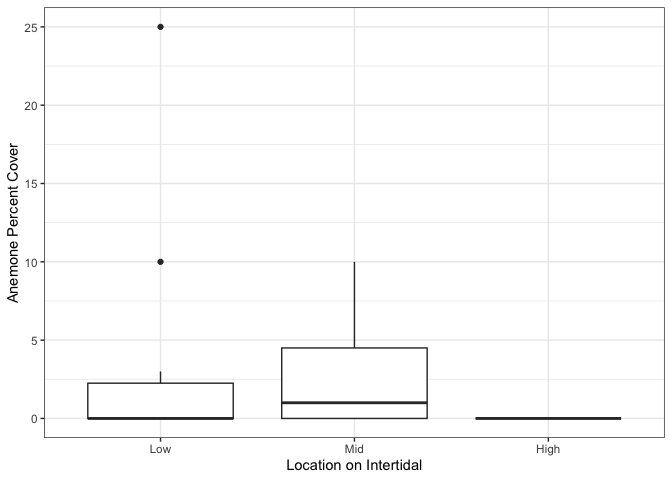
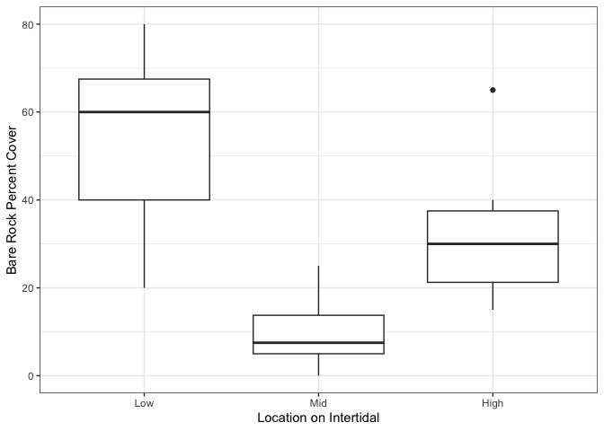
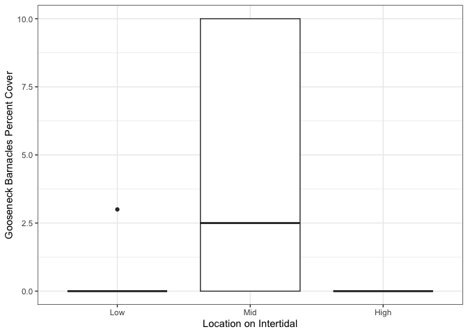

W9a Homework
================
Micaela Chapuis
2024-10-23

- [Assignment Details](#assignment-details)
- [Load Libraries](#load-libraries)
- [Load Data](#load-data)
- [Data Cleaning](#data-cleaning)
- [Function 1](#function-1)
  - [Example 1: Mean percent cover of mussels in the mid intertidal at
    Scripps](#example-1-mean-percent-cover-of-mussels-in-the-mid-intertidal-at-scripps)
  - [Example 2: Mean percent cover of algae in the low intertidal at
    Bodega](#example-2-mean-percent-cover-of-algae-in-the-low-intertidal-at-bodega)
  - [Example 3: Mean percent cover of small barnacles in the high
    intertidal at Starfish
    Point](#example-3-mean-percent-cover-of-small-barnacles-in-the-high-intertidal-at-starfish-point)
- [Function 2](#function-2)
  - [Example 1: Anemone percent cover at
    Scripps](#example-1-anemone-percent-cover-at-scripps)
  - [Example 2: Bare rock percent cover at Pyramid
    Point](#example-2-bare-rock-percent-cover-at-pyramid-point)
  - [Example 3: Gooseneck barnacles percent cover at Cape
    Arago](#example-3-gooseneck-barnacles-percent-cover-at-cape-arago)

## Assignment Details

Use any dataset you would like and make two useful functions. One that
is a plot and one that is not. Turn in your functions using RMarkdown
with at least 2 examples per function showing its flexibility.

## Load Libraries

``` r
library(tidyverse)
library(here)
```

## Load Data

``` r
intertidal <- read_csv(here("Week9", "Data", "intertidaldata.csv")) %>% glimpse()
```

    ## Rows: 450
    ## Columns: 13
    ## $ Site                  <chr> "Scripps", "Scripps", "Scripps", "Scripps", "Scr…
    ## $ Transect              <dbl> 1, 1, 1, 2, 2, 2, 3, 3, 3, 4, 4, 4, 5, 5, 5, 6, …
    ## $ Quadrat               <chr> "Low  .", "Mid", "High", "Low", "Mid", "High", "…
    ## $ `Bare Rock`           <dbl> 25, 50, 20, 10, 40, 40, 0, 30, 60, 0, 45, 70, 5,…
    ## $ Algae                 <dbl> 75, 0, 50, 85, 5, 5, 100, 5, 4, 100, 10, 0, 70, …
    ## $ Mussels               <dbl> 0, 5, 1, 0, 10, 0, 0, 10, 1, 0, 3, 0, 0, 5, 0, 0…
    ## $ `Small Barnacles`     <dbl> 2, 50, 50, 0, 40, 55, 0, 40, 20, 0, 25, 25, 20, …
    ## $ `Large Barnacles`     <dbl> 5, 5, 0, 0, 1, 0, 1, 0, 0, 0, 15, 5, 5, 0, 0, 5,…
    ## $ `Gooseneck Barnacles` <dbl> 0, 0, 0, 5, 5, 0, 0, 30, 5, 0, 0, 0, 0, 0, 0, 0,…
    ## $ Anemone               <dbl> 3, 0, 0, 0, 0, 0, 0, 0, 0, 0, 5, 0, 0, 10, 0, 0,…
    ## $ `Whelks (Counts)`     <dbl> 0, 0, 0, 0, 0, 0, 0, 0, 1, 0, 0, 0, 0, 1, 0, 0, …
    ## $ `Crabs (Counts)`      <dbl> 0, 0, 0, 0, 0, 0, 0, 0, 0, 0, 0, 0, 0, 0, 0, 0, …
    ## $ `Stars (Counts)`      <dbl> 0, 0, 0, 0, 0, 0, 0, 0, 0, 0, 0, 0, 0, 0, 0, 0, …

## Data Cleaning

Boooo cleaning strings (part 1)  
Cleaning column names

``` r
names(intertidal) <- names(intertidal) %>% # take column names
                     str_replace_all(pattern = "\\)|\\(", replacement = "") %>% # replace parentheses from col names with nothing
                     str_replace_all(" ", "_") # replace all spaces with _
```

Boooo cleaning strings (part 2)  
Cleaning Quadrat character data

``` r
intertidal$Quadrat <- intertidal$Quadrat %>% 
                      str_replace_all(pattern = "\\.|[0-9]", replacement = "") %>% # replace periods or numbers with nothing
                      str_trim() # trim white spaces
```

For the plots, I need to order the Quadrat column Low, Mid, High

``` r
intertidal$Quadrat <- factor(intertidal$Quadrat, levels=c("Low", "Mid", "High")) # make factor and put it into that specific order
```

## Function 1

I want this function to calculate the average percent cover of different
sessile inverts (and algae/rock) in the low, mid, or high intertidal
zone at some specific site. (Yes, it can also do it for the mobile
invert counts, but I couldn’t think of another more inclusive name, so
percent cover only it is.)

``` r
mean_pcover <- function(data = intertidal, site, quadrat, variable) { # data is intertidal by default, then we give it a site, a quadrat (low, mid, high intertidal location) and which variable we want the mean of
  avg <- data %>% 
    filter(Site == site & Quadrat == quadrat) %>% # only select the specified site and quadrat
    summarise(average = mean({{variable}}, na.rm =TRUE)) # take the mean of the specified variable
  return(avg)
}
```

### Example 1: Mean percent cover of mussels in the mid intertidal at Scripps

``` r
mean_pcover(site = "Scripps", quadrat = "Mid", variable = Mussels) # Scripps and Mid are characters because they are values in rows that we need to filter by, Mussels is a column
```

    ## # A tibble: 1 × 1
    ##   average
    ##     <dbl>
    ## 1     4.3

### Example 2: Mean percent cover of algae in the low intertidal at Bodega

``` r
mean_pcover(site = "Bodega", quadrat = "Low", variable = Algae)
```

    ## # A tibble: 1 × 1
    ##   average
    ##     <dbl>
    ## 1    98.5

### Example 3: Mean percent cover of small barnacles in the high intertidal at Starfish Point

``` r
mean_pcover(site = "Starfish Point", quadrat = "High", variable = Small_Barnacles)
```

    ## # A tibble: 1 × 1
    ##   average
    ##     <dbl>
    ## 1    92.8

## Function 2

Boxplot of percent cover of inverts at the different intertidal zones at
a specific site

``` r
pcover_plot <- function(data = intertidal, site, variable){ # data is intertidal by default, site and variable need to be specified
                data %>% 
                filter(Site == site) %>%  # filter by site
                ggplot(aes(x = Quadrat, y = {{variable}})) + # x axis is Quadrat column, y is the variable we specify
                  geom_boxplot() +
                theme_bw() + # theme
                labs(x = "Location on Intertidal")
}
```

### Example 1: Anemone percent cover at Scripps

``` r
pcover_plot(site = "Scripps", variable = Anemone) + 
  labs(y = "Anemone Percent Cover")
```

<!-- -->

### Example 2: Bare rock percent cover at Pyramid Point

``` r
pcover_plot(site = "Pyramid Point", variable = Bare_Rock) + 
  labs(y = "Bare Rock Percent Cover")
```

<!-- -->

### Example 3: Gooseneck barnacles percent cover at Cape Arago

``` r
pcover_plot(site = "Cape Arago", variable = Gooseneck_Barnacles) + 
  labs(y = "Gooseneck Barnacles Percent Cover")
```

<!-- -->
