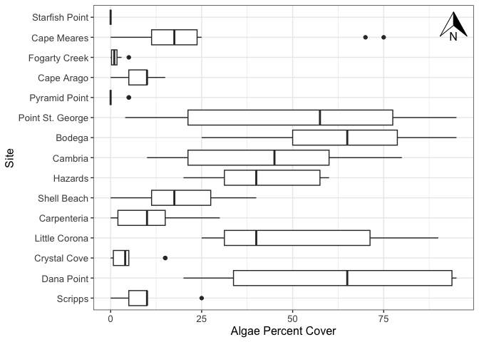

W9b Homework
================
Micaela Chapuis
2024-10-23

- [Assignment Details](#assignment-details)
- [Load Libraries](#load-libraries)
- [Load in Data](#load-in-data)
- [Joining data by site name](#joining-data-by-site-name)
- [Cleaning Data](#cleaning-data)
  - [Cleaning up the Quadrat strings (Low, Mid,
    High)](#cleaning-up-the-quadrat-strings-low-mid-high)
  - [Cleaning up the Column Names](#cleaning-up-the-column-names)
- [Plot](#plot)

## Assignment Details

Working with intertidal data. Today you will need to use skills that you
have learned in working with words to clean up some issues with the
character data and use what you learned today to reorder your factors
into orders that make sense. (Also the column headers could be better…).
HINT: New package idea to fix this is using the janitor package.

Your goal, as per usual, is to make a plot, any plot where one of the
axes is a factor. Save everything in the appropriate folders.

You have two possible files to play with in the data folder (you don’t
HAVE to use both): intertidal.csv and intertidal_latitude.csv (as well
as a data dictionary).

Importantly, if you decide to visualize anything by tide height it
should go from low to mid to high tide on the plot and if you decide to
visualize by site it should go in order of latitude (e.g. south to north
or north to south).

## Load Libraries

``` r
library(here)
library(tidyverse)
library(janitor)
library(ggspatial)
```

## Load in Data

``` r
intertidal_data <- read_csv(here("Week9", "Data", "intertidaldata.csv")) %>% glimpse()
```

    ## Rows: 450
    ## Columns: 13
    ## $ Site                  <chr> "Scripps", "Scripps", "Scripps", "Scripps", "Scr…
    ## $ Transect              <dbl> 1, 1, 1, 2, 2, 2, 3, 3, 3, 4, 4, 4, 5, 5, 5, 6, …
    ## $ Quadrat               <chr> "Low  .", "Mid", "High", "Low", "Mid", "High", "…
    ## $ `Bare Rock`           <dbl> 25, 50, 20, 10, 40, 40, 0, 30, 60, 0, 45, 70, 5,…
    ## $ Algae                 <dbl> 75, 0, 50, 85, 5, 5, 100, 5, 4, 100, 10, 0, 70, …
    ## $ Mussels               <dbl> 0, 5, 1, 0, 10, 0, 0, 10, 1, 0, 3, 0, 0, 5, 0, 0…
    ## $ `Small Barnacles`     <dbl> 2, 50, 50, 0, 40, 55, 0, 40, 20, 0, 25, 25, 20, …
    ## $ `Large Barnacles`     <dbl> 5, 5, 0, 0, 1, 0, 1, 0, 0, 0, 15, 5, 5, 0, 0, 5,…
    ## $ `Gooseneck Barnacles` <dbl> 0, 0, 0, 5, 5, 0, 0, 30, 5, 0, 0, 0, 0, 0, 0, 0,…
    ## $ Anemone               <dbl> 3, 0, 0, 0, 0, 0, 0, 0, 0, 0, 5, 0, 0, 10, 0, 0,…
    ## $ `Whelks (Counts)`     <dbl> 0, 0, 0, 0, 0, 0, 0, 0, 1, 0, 0, 0, 0, 1, 0, 0, …
    ## $ `Crabs (Counts)`      <dbl> 0, 0, 0, 0, 0, 0, 0, 0, 0, 0, 0, 0, 0, 0, 0, 0, …
    ## $ `Stars (Counts)`      <dbl> 0, 0, 0, 0, 0, 0, 0, 0, 0, 0, 0, 0, 0, 0, 0, 0, …

``` r
intertidal_sites <- read_csv(here("Week9", "Data", "intertidaldata_latitude.csv")) %>% glimpse()
```

    ## Rows: 15
    ## Columns: 2
    ## $ Site     <chr> "Starfish Point", "Cape Meares", "Fogarty Creek", "Cape Arago…
    ## $ Latitude <dbl> 47.65110, 45.47201, 44.83672, 43.30366, 41.99113, 41.78296, 3…

## Joining data by site name

``` r
intertidal <- left_join(intertidal_data, intertidal_sites)
```

## Cleaning Data

Oops I did this in the previous assignment, but I get to use the janitor
package this time!

### Cleaning up the Quadrat strings (Low, Mid, High)

``` r
intertidal$Quadrat <- intertidal$Quadrat %>% 
                      str_replace_all(pattern = "\\.|[0-9]", replacement = "") %>% # replace periods or numbers with nothing
                      str_trim() %>% # trim white spaces
                      factor(levels=c("Low", "Mid", "High")) # make factor and put levels in specific order
```

### Cleaning up the Column Names

``` r
intertidal <- clean_names(intertidal) # makes everything separated by _ and lowercase

# well that was easier, should've done this homework first
```

## Plot

Boxplot of algae percent cover in the mid intertidal by site (ordered by
latitude) with a north arrow

``` r
intertidal %>% 
  filter(quadrat == "Mid") %>% # only use Mid intertidal data
  ggplot(aes(x = algae, 
             y = fct_reorder(site, latitude))) + # order the sites by latitude (ascending)
    geom_boxplot() +
    theme_bw() +
    labs(x = "Algae Percent Cover",
         y = "Site") +
    annotation_north_arrow(location = "tr", # put a north arrow top right
                           height = unit(1, "cm"), # set arrow size
                           width = unit(1, "cm")) +
    theme(axis.title = element_text(size = 12), # making all the text bigger
          axis.text = element_text(size = 10))
```

<!-- -->

``` r
ggsave(here("Week9", "Output", "Homework", "w9b_homework.jpeg"))
```
